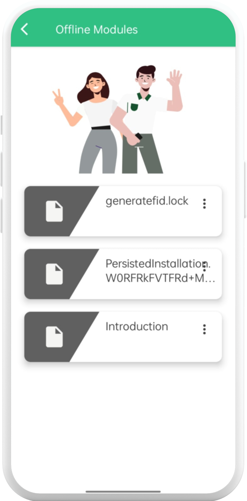
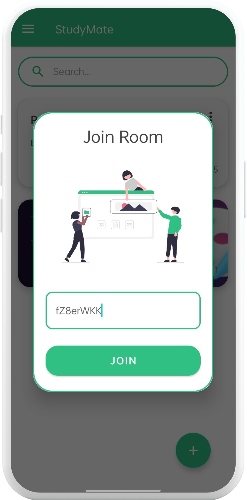
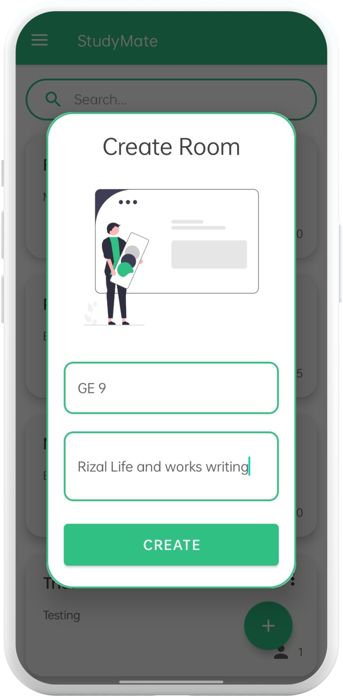
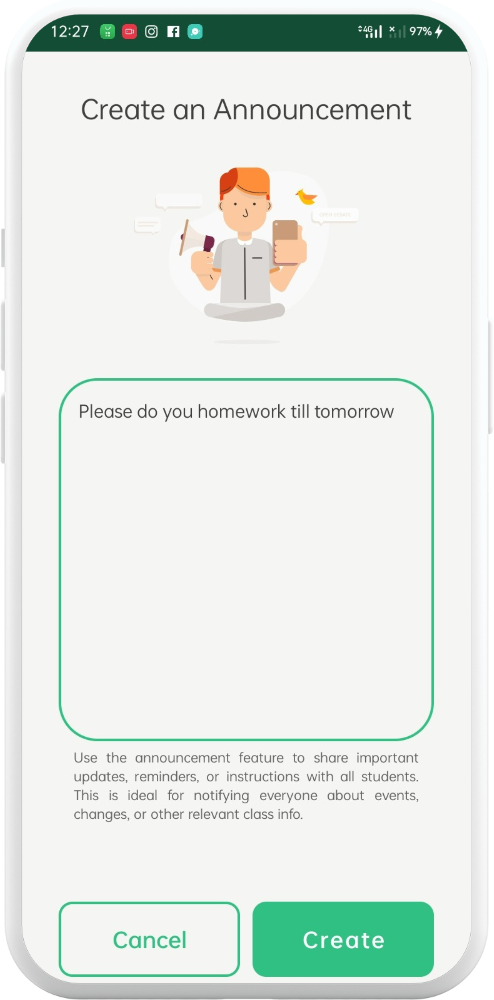
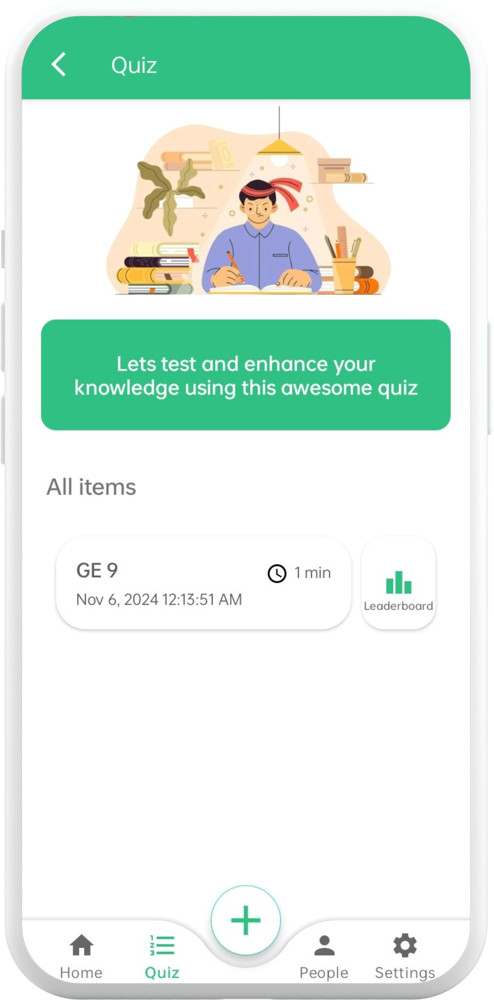
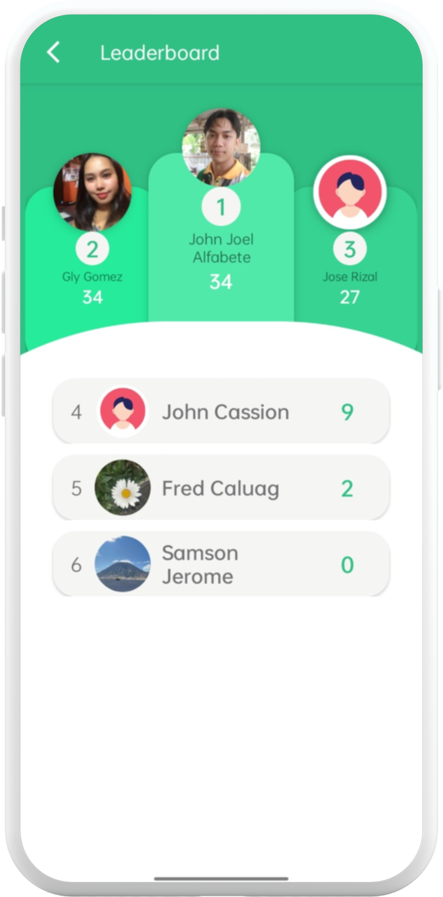
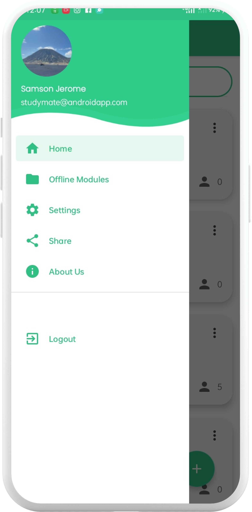
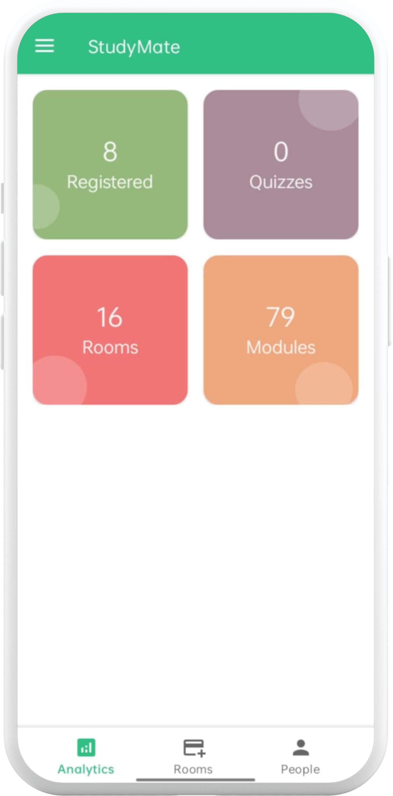

# 📚 StudyMate

Welcome to **StudyMate**! 🎉 A revolutionary mobile application designed to transform the learning experience for students and faculty alike. 🚀 StudyMate offers an intuitive platform that enhances education through seamless access to learning materials, real-time engagement, and flexible collaboration tools.

## 🎯 About the Project

StudyMate mobile application aims to improve the learning experience by offering an easy-to-use platform for students and faculty. It includes features like login options, course management, and real-time engagement tools, making it easier for users to access learning materials and communicate. The app is designed to improve user interaction, support both online and offline learning, and provide a flexible way for students and faculty to work together.

## ✨ Features

- 🔐 **Secure Login Options**: Multiple authentication methods for students and faculty.
- 📚 **Course Management**: Easily organize and access course materials.
- 💬 **Real-Time Engagement Tools**: Interactive features for communication and collaboration.
- 🌐 **Online & Offline Support**: Access materials anytime, anywhere.
- 📱 **User-Friendly Interface**: Intuitive design for enhanced user experience.
- 🔄 **Flexible Collaboration**: Seamless interaction between students and faculty.

## � Usage

1. Launch the app and log in with your credentials. 🔑
2. Explore courses and manage your learning materials. 📖
3. Engage in real-time discussions with peers and faculty. 💬
4. Access content offline for uninterrupted learning. 📶
5. Collaborate on projects and assignments flexibly. 🤝

## �🖼️ UI Previews

Here are some UI previews of the StudyMate application:

*Welcome interface with StudyMate branding and loading animation.*

### App Splash Screen

*Welcome interface with StudyMate branding and loading animation.*

### Offline Features

*Dashboard accessible offline with course summaries and quick access.*

### Course Modules Access

*Interface for opening and navigating through course modules.*

### Join Study Room

*Feature to join collaborative study rooms for group learning.*

### Create Study Room

*Tool to create new study rooms for organizing group sessions.*

### Collaboration Tools

*Comprehensive tools to create announcements, modules, and share links.*

### Quiz Features

*Additional advanced features including quiz creation capabilities.*

### Quiz Leaderboard

*Interactive leaderboard displaying quiz scores and rankings.*

### Navigation Panel

*Side panel with intuitive menus for easy app navigation.*

### Analytics Dashboard

*Detailed analytics view for tracking learning progress and performance.*


## 🌐 Learn More

<div style="text-align: center; margin: 20px 0;">
  <a href="https://codewith-freddie.github.io/studymate-website/" target="_blank" style="display: inline-block; padding: 12px 24px; background-color: #007bff; color: white; text-decoration: none; border-radius: 8px; font-weight: bold; font-size: 16px; box-shadow: 0 4px 6px rgba(0,0,0,0.1); transition: background-color 0.3s;">Learn More About StudyMate</a>
</div>

## 📁 Project Structure

```
studymate-mobile-application/
├── 📄 .gitignore
├── 🔧 build.gradle.kts
├── ⚙️ gradle.properties
├── 🏃‍♂️ gradlew
├── 🏃‍♀️ gradlew.bat
├── 🔨 settings.gradle.kts
├── 📱 app/
│   ├── 🔧 build.gradle.kts
│   ├── 📂 src/
│   │   ├── 🏠 main/
│   │   │   ├── 💻 java/
│   │   │   ├── 🎨 res/
│   │   │   │   ├── 🖼️ drawable/
│   │   │   │   ├── 📐 layout/
│   │   │   │   ├── 🎯 values/
│   │   │   │   └── ...
│   │   │   ├── 📋 AndroidManifest.xml
│   │   │   └── ...
│   │   └── 🧪 androidTest/
│   └── ...
├── 📂 gradle/
│   └── 📦 wrapper/
│       ├── 📦 gradle-wrapper.jar
│       └── 📄 gradle-wrapper.properties
└── 📖 README.md
```

## 🏗️ Development Methodology

The **Modified Waterfall Model** was chosen as the development methodology for StudyMate due to its structured and sequential approach, which ensured clear project phases and precise documentation. This model proved effective in systematically progressing through requirement gathering, design, development, and testing phases. Additionally, the inclusion of feedback loops allowed the team to revisit and refine previous phases when necessary. This adaptability ensured that any errors or new requirements identified during later stages could be addressed without compromising the overall project structure.


## 📜 License

This project and its contents are the exclusive intellectual property of the author and are protected under copyright law. Unauthorized copying, modification, distribution, or plagiarism of this project is strictly prohibited and may result in legal action. All rights are reserved.


## 📧 Contact

For questions or support, please contact [Freddie Alicante](https://www.linkedin.com/in/codewith-freddie/). 💌
